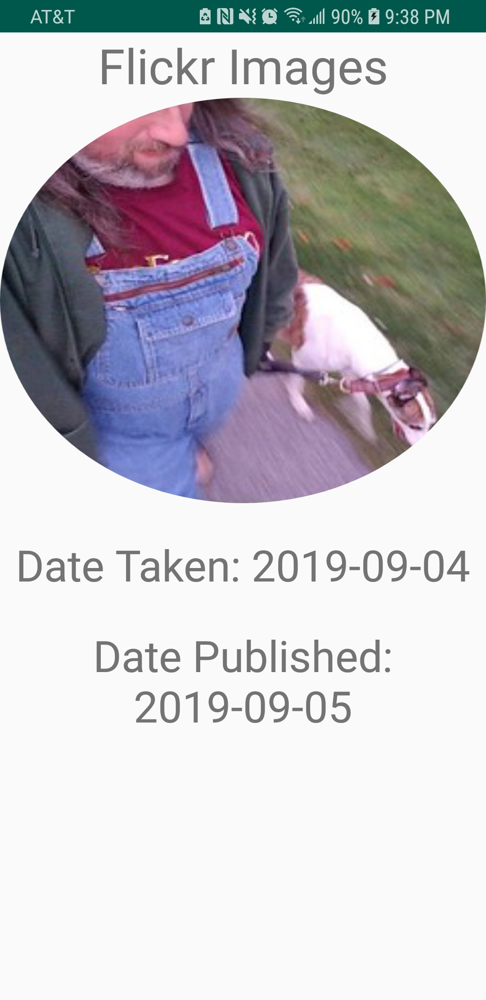
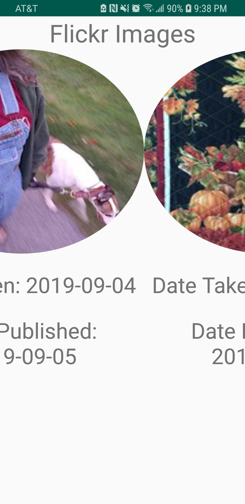
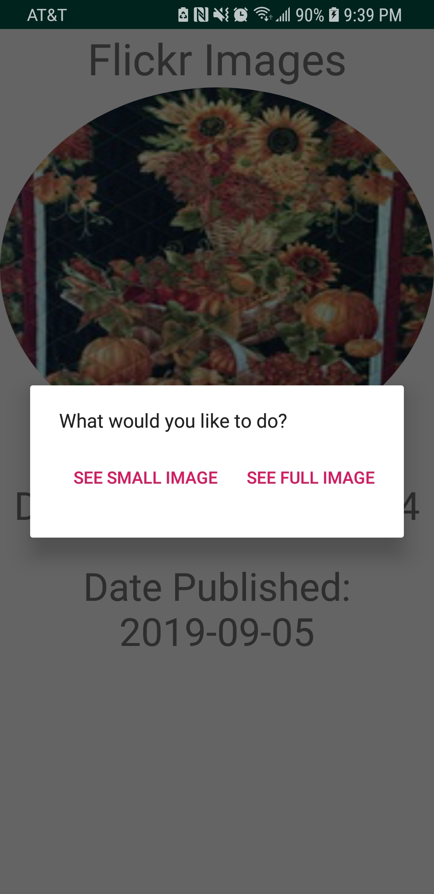
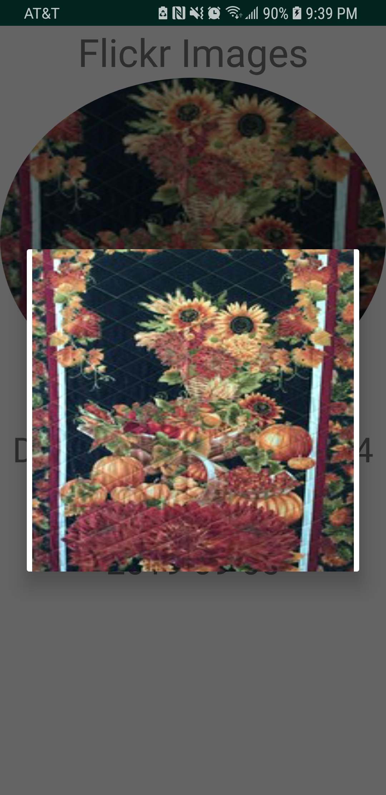

# Week4Daily3OkHttp
This application aims to make a call to the Flickr API, fill a RecyclerView with images in the response from the API, and create a dialog box when an item in the RecyclerView is clicked for a long time. The dialog box has two options: one to start a new activity with a full image view of the selected item and another to show the selected image within another dialog box.

## MainActivity
This activity instantiates and binds a recycler upon creation, then starts an AsyncTask to make the Flickr API call. It uses EventBus to receive a FlickrResponseEvent which holds an object representing the Flickr API response. Then, it extracts a List of items from the Flickr Response Object, and fills the RecyclerView with this list by passing it to a FlickrImagesAdapter object which is passed to the RecyclerView.

 

## Full Image Activity
This activity only has a single ImageView in it. It gets the Intent that started it, extracts the URL string from the Intent, then uses the Glide 3rd party library to fill the image.

## FlickerImagesAdapter
This is an average adapter that takes in a List of ItemsItem Objects that are generated from the Flickr API response. Each view holder has an onLongClick listener attached that brings up an AlertDialog with two buttons on it: "See Full Image" and "See Small Image". The "See Full Image" button creates an intent that will start FullImageActivity, takes the image's URL string from an invisible TextView and attaches it to the Intent, and starts the activity using the Intent. The "See Small Image" button inflates a View holding an ImageView, fills the ImageView with the selected item's image, builds a AlertDialog, sets the dialog's view to the inflated View, and shows the AlertDialog.

  

### FlickrAsyncTask
This class uses the OkHttpHelper to make the API call, parses the response into a FlickrResponse Object, wraps that object in an FlickrResponseEvent class, then passes the FlickrResponseEvent back to MainActivity using EventBus' post message.

### OkHttpHelper
This class simply handles the API call and returns the response as a String.
